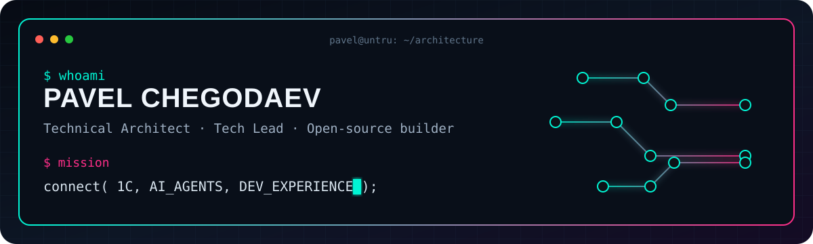

<p align="center">
  
</p>

<p align="center">
  
</p>

```yaml
name: Pavel Chegodaev
role: Technical Architect / Tech Lead
focus: [1C Architecture, AI Agents, MCP, DevEx, DevOps]
mode: building
location: Moscow
```

## `./featured-projects --impact`

<table>
<tr>
<td width="50%" valign="top">

### 🧠 [1c-mcp](https://github.com/Untru/1c-mcp)

Единая карта MCP-серверов для экосистемы 1С: от метаданных и справки до тестирования, code review и работы с живыми базами.

`AI` `MCP` `1C` `Open Source`

</td>
<td width="50%" valign="top">

### 🦀 [ibcmd-rs](https://github.com/Untru/ibcmd-rs)

Исследовательский автономный инструмент на Rust для работы с конфигурациями 1С без медленного штатного цикла.

`Rust` `R&D` `Binary formats`

</td>
</tr>
<tr>
<td width="50%" valign="top">

### ⚙️ [GitManager](https://github.com/Untru/gitmanager)

Git Flow, задачи, ветки и автоматизация сборки/разборки исходников — непосредственно из интерфейса 1С.

`DevEx` `Git Flow` `OneScript`

</td>
<td width="50%" valign="top">

### 🤖 [Share-BSL](https://github.com/Untru/share_bsl)

Telegram-бот, который принимает файлы 1С, разбирает их на исходники и публикует результат для ревью.

`Telegram` `Automation` `BSL`

</td>
</tr>
</table>

## `./experience --summary`

```diff
+ 16+ лет разработки и архитектуры 1С
+ 20+ запущенных складских проектов
+ Руководство разработкой WMS и техническое наставничество
+ DevOps, CI/CD, автоматизированное тестирование и code review
+ Докладчик INFOSTART TEAMLEAD & CIO EVENT
```

## `./stack --visual`

<p align="center">
  
</p>

<p align="center">
  
  
</p>

<p align="center"><code>open for architecture • open source • talks • collaboration</code></p>

<p align="center"><a href="../README.md">← Все пять концептов</a></p>
