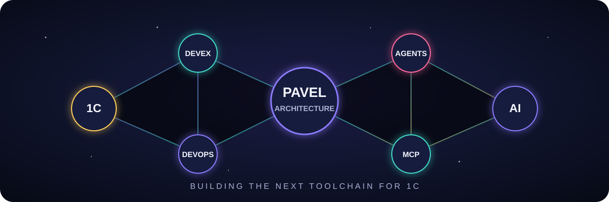
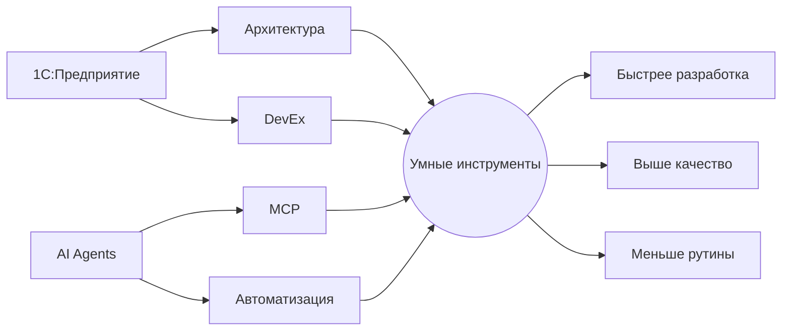

  

<h1 align="center">Павел Чегодаев</h1>

  <b>Соединяю глубину 1С с возможностями AI-инструментов</b> 
  Архитектура систем · агентная разработка · MCP · инструменты для команд

  
  
  

## Моя область

## Проекты, которые двигают эту идею

| | Проект | Что меняет |
|---|---|---|
| 🪐 | **[1c-mcp](https://github.com/Untru/1c-mcp)** | Делает экосистему AI-инструментов для 1С обозримой и совместимой |
| 🦀 | **[ibcmd-rs](https://github.com/Untru/ibcmd-rs)** | Исследует новый быстрый путь работы с конфигурациями 1С |
| 🧭 | **[GitManager](https://github.com/Untru/gitmanager)** | Переносит современный Git workflow в привычный интерфейс 1С |
| ✨ | **[Share-BSL](https://github.com/Untru/share_bsl)** | Превращает бинарные файлы 1С в доступный для ревью исходный код |

## В цифрах

  

| 16+ лет | 20+ запусков | 135+ ⭐ | 4 направления |
|:---:|:---:|:---:|:---:|
| в 1С-разработке | складской автоматизации | у 1c-mcp | Architecture · AI · DevEx · Leadership |

## За пределами кода

- Выступаю на профессиональных конференциях
- Помогаю разработчикам расти через code review и наставничество
- Курирую обучение чистому коду
- Проектирую процессы и инструменты, которыми удобно пользоваться каждый день

<i>Сложность должна оставаться внутри системы, а не перекладываться на пользователя.</i>

<a href="../README.md">← Все пять концептов</a>

