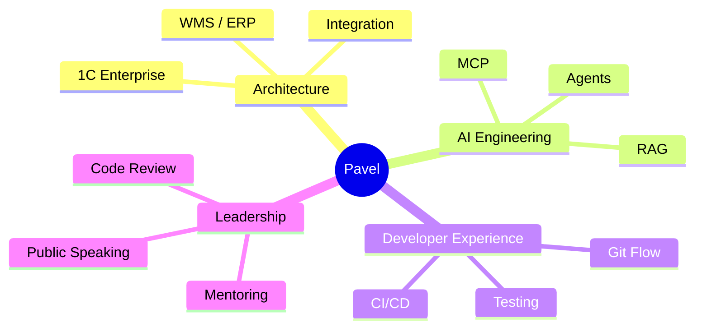

<p align="center">
  
</p>

<p align="center">
  
  
  
</p>

## Overview

```text
┌──────────────────────────────────────────────────────────────────┐
│ Pavel Chegodaev                                                  │
│ Technical Architect / Tech Lead                                  │
├──────────────────────┬──────────────────────┬────────────────────┤
│ 16+ years            │ 20+ launches         │ 135+ repo stars    │
│ enterprise 1C        │ warehouse projects   │ flagship project   │
└──────────────────────┴──────────────────────┴────────────────────┘
```

## Live GitHub telemetry

<p align="center">
  
  
</p>

<p align="center">
  
</p>

## Product matrix

| Status | Repository | Domain | Outcome |
|:---:|---|---|---|
| 🟢 | **[1c-mcp](https://github.com/Untru/1c-mcp)** | AI / MCP | Навигация по AI-инструментам экосистемы 1С |
| 🟡 | **[ibcmd-rs](https://github.com/Untru/ibcmd-rs)** | Rust / R&D | Автономная обработка конфигураций 1С |
| 🟢 | **[GitManager](https://github.com/Untru/gitmanager)** | Developer Experience | Git Flow и автоматизация исходников в 1С |
| 🟡 | **[Share-BSL](https://github.com/Untru/share_bsl)** | Automation | Разбор и публикация кода через Telegram |
| 🟢 | **[pivo-cli](https://github.com/Untru/pivo-cli)** | CLI / OneScript | Автоматизация команд разработки и доставки |

## Capability map



## Current signals

<p align="center">
  
</p>

<details>
<summary><b>Professional background</b></summary>

- Руководство отделом разработки WMS
- Проектирование архитектуры и интеграций
- DevOps, CI/CD, Vanessa Automation, Sonar и мониторинг
- 20+ запусков складских проектов
- Докладчик и наставник разработчиков

</details>

<p align="center"><a href="../README.md">← Все пять концептов</a></p>
